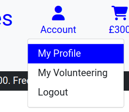
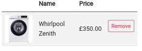
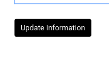
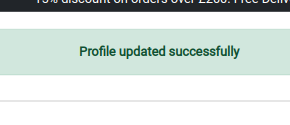
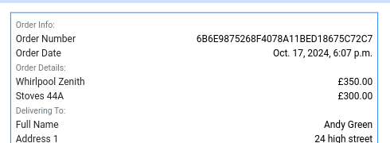
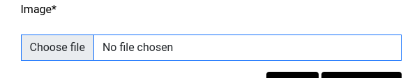
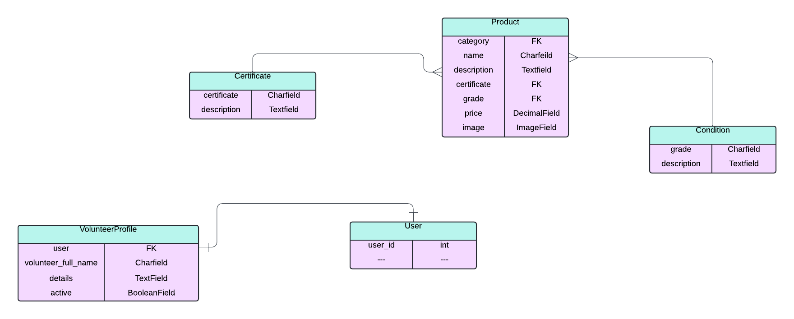

# Community Appliances
## [Live site here](https://community-appliances-3af27dd26db9.herokuapp.com/)
# Strategy
## Overview
- Community Appliances is a django e-commerce app that allows users to purchase refurbished domestic appliances (washing machines and electric and gas cookers) from a fictional charity organisation. The charity accepts donations of used appliances which are refurbished for sale to raise funds. The organisation is run by volunteers and the app also enables new volunteers to sign-up if they have an account. E-commerce functionality is via the [Stripe](https://stripe.com/gb) on-line payment platform.
# Scope
## User Stories
The design of the app was guided by user stories. The categories of user considered were,
- visitors without an account
- users with an account
- site owner (Admin)

To allow analysis user stories were categorised into the areas of functionality below
- Making purchases
- Registering for an account
- Users with an account
- Managing the store

### Making Purchases
The following apply to users with or without an account 
- As a user I want to view items by category, ordered by condition or price
- As a user I want to view detailed information on selected items
- As a user I want to view, add and remove items in my cart 
- As a user I want to enter my delivery details and view my cart and payment details at checkout
- As a user I want to have a familiar experience making on-line payment for my items and have access to all the relevant details
- As a user I want to get an email confirming my order has been placed.

### Registering for an Account
- As a user I want to sign-up for an account to access useful/interesting additional features in the app

### Users with an Account
Visitors can make purchases with or without an account. However, signing-up for an account gives users access to additional useful or interesting functionality
- As a user with an account I want to create and update default delivery information to prefill my delivery details into a form at checkout
- As a user with an account I want to view a record of previous purchases, ie an order-history
- As a user with an account I want the option to make a volunteer profile linked to my account, in order to volunteer with the charity

### Managing the Store (Admin User)
The store admin needs access to order details in the database in order to fullfil customer orders. Additionally, the admin user needs to manage user accounts and user profiles and volunteer profiles. These actions are currently performed via the Django admin panel. The admin also needs to be able to add and remove products, and edit product details. The later actions can be performed via the Django admin panel but the app provides a more user-friendly interface for store owners to add and edit products in the store database without going through the Django admin panel.

- As an admin user I want full CRUD functionality for all models in the application database.
- As an admin user I want a user-friendly interface for adding new products and editing products in the store.


### User Messaging
Providing users with immediate feedback from interactions with the app was a key consideration in design. Colour coded alert Bootsrap alerts together with the Django messaging system achieved this goal.
- As a user I want immediate clear feedback messages from interactions with the app

# Structure
## Features
### Main Navigation - All Pages


The main navigation contains the site logo which acts as a link back to the home page from anywhere on the site. The navbar also has an account dropdown and a link to the users cart diplaying the value of the cart.


For a non logged in user the account dropdown shows links to the login and registration pages.



For a logged in user the account dropdown contains links to a user profile and a volunteer profile page.

The main navbar displays a horizontal menu of options to search for appliances by category 


When selected, each category displays a dropdown with options to search by price or grade (condition) ascending or descending


On small devices the menu of options collapses behind a hamburger button


### Home Page

The home page introduces the charity and gives users some background information.
The page features a prominent "Shop Now" button to invite users to easily engage with the site and clicking this takes the user to the products page which initially displays a default view of all appliances ordered by price descending.


### Products Page

The products page shows appliances in the chosen category (or "All Appliances") with the selected ordering. The products are presented in an attractive card format with some initial information. Clicking on a card takes the user to a product details page for the selected product.


To assist the user the products page title clearly indicates the the category of products displayed,


### Product Details Page

Product details for a selected item are again presented in a familiar card format. 


The product details card contains a number of features to assist the user
- A clickable image to open a larger view of the item
- A dropdown on hover giving a more detailed description of the item grade

 

- A button to add the item to the users cart

 

- When an item is successfully added to the cart a message informs the user

 

 - If the item is already in the cart a message alert informs the user 

 

-  The "Keep Shopping" button is included to quickly return the user to the products page initially displaying all items ordered by price descending

 

### Cart Page

- Clicking the cart icon link in the main navigation takes the user to the cart page


- Details of cart contents are shown to the user in a clear table format


- A button is provided to remove an item if desired


- On removing an item a message is shown to inform the user


- For extra-small devices a condensed version of the cart contents table is displayed with the description column ommited and a smaller remove button



- If the cart is empty the user is informed


-   The "Continue Shopping" button is included to quickly return the user to the products page initially displaying all items ordered by price descending

 

- Once the user is ready to checkout the "Checkout" link button takes the user to the checkout page


### Checkout Page

The checkout page contains the form for delivery details, a summary of the cart contents and a card payment details input facility for making payments via Stripe.

- For non logged in users a form containing prompts is provided for delivery details


- If the user is not logged in links are shown below the form to the log in and sign-up pages if the user wishes to change or save their delivery details to a user profile.


- If the user has an account the delivery details form will be prefilled by any default details contained in their "profile". If the user wishes to update their default details with the information entered in the form a checkbox is provided


- Basic postcode validation is implemented for the delivery details form which results in an alert message for an invalid form entry


- A clear summary of the cart contents, and payment breakdown is provided to the user in tabular format


- The payment details are again highlighted in warning text next to the payment button to alert the user before they confirm the purchase. If a discount applies this is displayed.


- A Stripe card payment input box is located at the end of the form


- Next to the button to confirm the purchase, is a button link titled "Adjust Cart" back to the users cart. This gives the user an opportunity if they wish, to add or remove items from the cart before proceding with payment


- A "Complete Order" button submits the completed form to process the payment via the Stripe platform.


### Checkout Success Page

- A successful checkout triggers the checkout success page informing the user the user they will get email confimation of their purchase.


- An order breakdown with all relevant details is displayed.


- The "Continue Shopping" button at the bottom of the order confirmation invites the user to continue engagement with the site. The button provides a link to the products page displaying the default of all products ordered by descending price.


### Profile Page

A user profile is created for all account holders and can be accessed via the link in the dropdown from the account icon in the main navbar.

The profile can be used to store default delivery details to prefill into the checkout form, and also to access details of previous orders ie an order history.

- The page displays a form showing default delivery details and a table showing a summary of previous orders. The entries in the order history table are clickable links to a more detailed order history view for the particular order.


- The default delivery details can be edited by the user and clicking the update button notifies the user of a successful update






- Basic postcode validation is implemented for the default delivery details form which results in an alert message for an invalid form entry


### Order History Page

The details of previous purchases are available to account holders by clicking a link for a particular order in the order history table of the profile page.

- An info alert box reminds the user they are viewing details of a previous order


- Previous order details are displayed in a tabular format



- A button provides a link back to the profile page


### Volunteers Page
A volunteers profile is created for all account holders and logged in users access their profile via a link in the account icon dropdown in the main navbar. 


- Users who wish to volunteer with the charity can leave their details in the form


- Users can toggle the "Active" checkbox to indicate their availability


- Users can save changes to their details via an "Update Information" button


- An alert success message informs the user of a successful update 


### Product Management Pages
For convenience, store owners (superusers) are able to create and edit products on the app backend without going through the Django admin panel. This is achieved via "Add Product" and "Edit Product" pages available on the front-end but only accessible only to store owners.

#### Product Add Page
- When the store owner is logged in an additional "Product Management" option is visible in the account dropdown


- Clicking the dropdown link takes the user to a page containing a form to add details of a new product to store database.


- Option dropdowns in the form allow users to select pre-defined category, grade and safety certificate options as specified in the Product model. 


- The mobile view of the select dropdown for categories is shown below and similar mobile-style dropdowns are implemented for the product grade (condition) and category.


- Image file upload is via a form widget input



- The form is validated according to the model constraints


- Messaging is provided to keep the user informed of all actions. 


- In the event of a form validation error the following alert is given


- Buttons confirm the action or alternatively cancel the action. Cancelling returns the user to the products listing view (ie default listing of all products by descending price). Clicking the "Add Product" button takes the user to the product details card view for the newly added product.


#### Product Edit Page
- Product editing (update and delete) is available to superusers via links in the product details card view of an existing product. These links are only visible to superusers


- Clicking the "Edit" link takes the superuser to a product edit form prepopulated with the product current details from the datadase. An info message is displayed informing the user of the name of the product they are editing.

- Option dropdowns in the form allow users to change category, grade and safety certificate options for an existing product. 


- An example mobile view of the option dropdown for safety certificates is shown below


- The product image can be changed via a form widget input


- The form is validated according to the model constraints


- Messaging is provided to keep the user informed of all actions. 


- In the event of a form validation error the following alert is given


- Buttons confirm the action or alternatively cancel the action. Cancelling returns the user to the products listing view (ie default listing of all products by descending price). Clicking the "Update Product" button takes the user to the product details card view for the updated product.


- The "Delete" link in the product card deletes the product form the database.


# Skeleton
## Wireframes
| Page | Device | Wireframe |
| --- | --- | --- |
| Home | mobile | [wireframe](documentation/readme/wireframes/wireframe-mobile-home.jpg) |
| Products |mobile  | [wireframe](documentation/readme/wireframes/wireframe-mobile-products.jpg) |
| Product Details | mobile | [wireframe](documentation/readme/wireframes/wireframe-mobile-product-details.jpg) |
| Cart | mobile | [wireframe](documentation/readme/wireframes/wireframe-mobile-cart.jpg) |
| Checkout | mobile | [wireframe](documentation/readme/wireframes/wireframe-mobile-checkout.jpg) |
| Checkout Success | mobile | [wireframe](documentation/readme/wireframes/wireframe-mobile-checkout-success.jpg) |
| Profile | mobile | [wireframe](documentation/readme/wireframes/wireframe-mobile-profile.jpg) |
| Volunteers | mobile | [wireframe](documentation/readme/wireframes/wireframe-mobile-volunteers.jpg) |
| Order History | mobile | [wireframe](documentation/readme/wireframes/wireframe-mobile-order-history.jpg) |
| Home | tablet | [wireframe](documentation/readme/wireframes/wireframe-tablet-home.jpg) |
| Products | tablet  | [wireframe](documentation/readme/wireframes/wireframe-tablet-products.jpg) |
| Product Details | tablet | [wireframe](documentation/readme/wireframes/wireframe-tablet-product-details.jpg) |
| Cart | tablet | [wireframe](documentation/readme/wireframes/wireframe-tablet-cart.jpg) |
| Checkout | tablet | [wireframe](documentation/readme/wireframes/wireframe-tablet-checkout.jpg) |
| Checkout Success | tablet | [wireframe](documentation/readme/wireframes/wireframe-tablet-checkout-success.jpg) |
| Profile | tablet | [wireframe](documentation/readme/wireframes/wireframe-tablet-profile.jpg) |
| Volunteers | tablet | [wireframe](documentation/readme/wireframes/wireframe-tablet-volunteers.jpg) |
| Order History | tablet | [wireframe](documentation/readme/wireframes/wireframe-tablet-order-history.jpg) |
| Home | desktop | [wireframe](documentation/readme/wireframes/wireframe-desktop-home.jpg) |
| Products | desktop  | [wireframe](documentation/readme/wireframes/wireframe-desktop-products.jpg) |
| Product Details | desktop | [wireframe](documentation/readme/wireframes/wireframe-desktop-product-details.jpg) |
| Cart | desktop | [wireframe](documentation/readme/wireframes/wireframe-desktop-cart.jpg) |
| Checkout | desktop | [wireframe](documentation/readme/wireframes/wireframe-desktop-checkout.jpg) |
| Checkout Success | desktop | [wireframe](documentation/readme/wireframes/wireframe-desktop-checkout-success.jpg) |
| Profile | desktop | [wireframe](documentation/readme/wireframes/wireframe-desktop-profile.jpg) |
| Volunteers | desktop | [wireframe](documentation/readme/wireframes/wireframe-desktop-volunteers.jpg) |
| Order History | desktop | [wireframe](documentation/readme/wireframes/wireframe-desktop-order-history.jpg) |

# Surface

### Colour Palette
The colour palette used for site styling was chosen to be bold and clean in keeping with the site theme of domestic appliances,
- blue #0000ff
- black #000000
- white #ffffff

### Bootstrap Alerts
Colour coded bootstrap [alerts](https://getbootstrap.com/docs/4.1/components/alerts/) were used for messaging

### Typography
[Roboto](https://fonts.google.com/specimen/Roboto) font was used for all site text.

[Bootstrap](https://getbootstrap.com/docs/5.3/utilities/colors/#colors) danger and success text coloring was used in some places to convey additional messaging to users.

# Database
- The app uses a Postgresql relational database deployed on the [ElephantSQL](https://www.elephantsql.com/) platform. For local development the app used a **SQLite** database.

### Database Relationships

The app uses three custom models in addition to those used in the Boutique Ado walkthrough and these are shown in the entity relationship diagram below. Only relationships involving the custom models are shown and not all fields in the default User model are included.
The diagram shows
- A one-to-one relationsip of the VolunteerProfile model to the User model
- A many-to-one relationship between the Certificate model and the Product model
- A many-to-one relationship between the Condition model and the Product model



# Deployment
## Heroku
The app uses the [Heroku](https://www.heroku.com/) platform for deployment.
* First create a new app in the Heroku dashboard and connect to your github repository.
* In the project repo install the following dependencies required to use postgresql external database
```bash
pip3 install dj_database_url
pip3 install psycopg2
```
* Import at the top of settings.py
```python
import os
import dj_database_url
```


* Update the ```requirements.txt``` file
```bash
pip freeze > requirements.txt
```
* Create a ```Procfile``` in the project to tell Heroku what to do and add the following code
```bash
web: gunicorn [your app name].wsgi:application
release: python manage.py migrate

```
* Commit and push these changes to Github.

### Heroku Configvars

* The following "configvars" key-values need to be provided in the Heroku dashboard. 
```bash
AWS_ACCESS_KEY_ID = from AWS setup
AWS_SECRET_ACCESS_KEY = from AWS setup
DATABASE_URL = from elephantSQL
EMAIL_HOST_PASS = from email server setup
EMAIL_HOST_USER = from email server setup
SECRET_KEY = insert value here
STRIPE_PUBLIC_KEY = from Stripe setup
STRIPE_SECRET_KEY = from Stripe setup
STRIPE_WH_SECRET = from Stripe setup
USE_AWS = True

```
* The required values for the above Heroku [configvars ](https://github.com/doctorandrewbrown/community-appliances/blob/main/README.md#heroku-configvars) are obtained as discussed in the sections below.
## AWS
The AWS S3 service is used to host static javascript, css and media files for the app.
* In the AWS dashboard find the service S3 and select "create bucket"
* ACLs enabled and Bucket owner preferred needs to be selected from Object Ownership panel
* Uncheck "Block all public access" option
* Click create bucket and in the properties tab enable "static website hosting"
* In the Permissions tab paste in the COORS configuration
```json
[
    {
        "AllowedHeaders": [
            "Authorization"
        ],
        "AllowedMethods": [
            "GET"
        ],
        "AllowedOrigins": [
            "*"
        ],
        "ExposeHeaders": []
    }
]
```
* Edit the ACL access control list to allow public access
* In the Permissions tab select edit Bucket Policy - select policy generator to create a security policy for the bucket
* Select S3 for policy type in the policy generator page
* Enter "*" in Principal input box and select "get object" from actions list and paste ARN (Amazon resource number) into box and click "Generate policy"
* Copy the policy into the bucket policy editor add "/*" to the end of the ARN
```json
{
  "Id": "Policy1729615099960",
  "Version": "2012-10-17",
  "Statement": [
    {
      "Sid": "Stmt1729615059042",
      "Action": [
        "s3:GetObject"
      ],
      "Effect": "Allow",
      "Resource": "arn:aws:s3:::community-appliances/*",
      "Principal": "*"
    }
  ]
}
```
## IAM
Now use another AWS service called IAM to create a user-group and user to access the S3 bucket.

* Find I AM in the AWS dashboard and click User Groups and Create Group giving the group a relevant name.
* Select Policies from the side menu and select Create Policy
* From the JSON tab, select import managed policy to import a premade AWS policy with full access to S3
* Select AmazonS3FullAccess policy and adapt as below using the ARN for the S3 bucket
```json
{
    "Version": "2012-10-17",
    "Statement": [
        {
            "Effect": "Allow",
            "Action": [
                "s3:*"
            ],
            "Resource": [
                "arn:aws:s3:::community-appliances",
                "arn:aws:s3:::community-appliances/*"
            ]
        }
    ]
}
```
* Next Review Policy and give it a name and description, and click Create policy
* Now attach the policy to the User group by selcting groups, then permissions. 
* Open the Add Permissions dropdown and click Attach policies
* Select the policy and then click Add permissions button.
* Now create a user to add to the user group by selecting Users then Add user
* Give the user a name and select Programatic Access for AWS Access type, then select next
* Click through to Create user button
* Next get access keys for the user by going to Users and selcting the user
* Select the 'Security Credentials' tab
* Scroll to 'Access Keys' and click 'Create access key'
* Select 'Application running outside AWS', and click next
* On the next screen, you can leave the 'Description tag value' blank. Click 'Create Access Key'
* Click the 'Download .csv file' button to get a copy of the access keys to use as Heroku [configvars ](https://github.com/doctorandrewbrown/community-appliances/blob/main/README.md#heroku-configvars) with the following names
```bash
AWS_ACCESS_KEY_ID 
AWS_SECRET_ACCESS_KEY 
```

## Connecting S3 Bucket to the Django App
* Install the packages boto3 and django-storages
```bash
pip install django-storages
pip install boto3
pip freeze > requirements.txt
```
* Add "storages" to installed apps in settings.py project file
* Add the values from the .csv as mentioned above to Heroku [configvars ](https://github.com/doctorandrewbrown/community-appliances/blob/main/README.md#heroku-configvars) using the names
```bash
AWS_ACCESS_KEY_ID = ...
AWS_SECRET_ACCESS_KEY = ...
```
* Remove ```DISABLE_COLLECTSTATIC``` variable from Heroku [configvars ](https://github.com/doctorandrewbrown/community-appliances/blob/main/README.md#heroku-configvars) if present
* In the AWS S3 dashboard create folders called media and static to hold the relevant files and grant public read access

## Stripe API
The app uses the [Stripe](https://stripe.com/gb) payment platform to implement ecommerce functionality and the Stripe credentials are obtained via the account dashboard. The Stripe credentials are placed in Heroku [configvars ](https://github.com/doctorandrewbrown/community-appliances/blob/main/README.md#heroku-configvars) with the following names
```bash
STRIPE_PUBLIC_KEY = pk....

STRIPE_SECRET_KEY = sk....
```

## Gmail Setup
The app uses gmail to send order confirmation and account verification emails using [Gmail](https://mail.google.com/mail/).
* Click on the Account Settings in Gmail.
* Click on the Accounts and Import tab.
* In the section called "Change account settings", click on the link for Other Google Account settings.
* Select Security.
* Select 2-Step Verification to turn it on. (verify your password and account)
* Select Turn On for 2FA.
* On the Security page, select the option called App passwords.
* Select Mail for the app type.
* Select Other (Custom name) for the device type.
* Add any custom name
* Save the 16-character password (API key).
* The Gmail credentials are placed in Heroku [configvars ](https://github.com/doctorandrewbrown/community-appliances/blob/main/README.md#heroku-configvars) with the following names
```bash
EMAIL_HOST_PASS = 16-character API key
EMAIL_HOST_USER = users Gmail email address

```

## ElephantSQL
The app uses a postgreSQL database hosted by [ElephantSQL](https://www.elephantsql.com/)
* Sign up for an account
* Once logged in, click the "Create new instance" button to create a new PostgreSQL database instance.
* Choose the Free Tiny Turtle plan.
* Click the "Select Region" button and select a data centre from the dropdown.
* Confirm the new database instance by clicking "Create instance" button.
* The database url provided in the step above is then used as the value of the Heroku [configvars ](https://github.com/doctorandrewbrown/community-appliances/blob/main/README.md#heroku-configvars) variable named 
```bash
DATABASE_URL = ...
```

## Local Deployment

This project can be **cloned** or **forked** in order to make a local copy on your own system.

### Cloning

You can clone the repository by following these steps:

1. Go to the [GitHub repository](https://github.com/doctorandrewbrown/flask-resource-keeper) 
2. Locate the Code button above the list of files and click it 
3. Select if you prefer to clone using HTTPS, SSH, or GitHub CLI and click the copy button to copy the URL to your clipboard
4. Open Git Bash or Terminal
5. Change the current working directory to the one where you want the cloned directory
6. In your IDE Terminal, type the following command to clone my repository:
	```bash
    git clone https://github.com/doctorandrewbrown/community-appliances.git
    ```
7. Press Enter to create your local clone.

### Forking

By forking the GitHub Repository, we make a copy of the original repository on our GitHub account to view and/or make changes without affecting the original owner's repository.
You can fork this repository by using the following steps:

1. Log in to GitHub and locate the [GitHub Repository](https://github.com/doctorandrewbrown/community-appliances.git)
2. At the top of the Repository (not top of page) just above the "Settings" Button on the menu, locate the "Fork" Button.
3. Once clicked, you should now have a copy of the original repository in your own GitHub account!

# Future Work on the App
* The app still has a few aspects related to "stock control" that need to be addressed before a full production version would be ready. These issues are due to the current business model of selling single items. At present when a user adds an item to their cart it remains in the list of items for sale on the site. Even though the current user can not add an item already in their cart a concurrent user would be able to do so. Code could be implemented to remove an item from sale when an order is confirmed however, the problem remains if a concurrent user had the item in their cart. The issues above would clearly need further attention in a full production version of the app.

* The current MVP has basic functioning e-Commerce ability, however Stripe webhooks could be implemented as a future development to make things more robust.

* General search functionality beyond what is currently provided was not considered a priority at the outset given the limited amount of stock envisaged for a store such as the current one. However, a future feature which would improve the Product Management experience would be the ability to search for a product by name in order to edit. This feature could be added as part of the existing front-end Product Management functionality described above.


# Tools and Technologies

### Languages
- HTML5
- CSS3
- Python3
- Javascript

### Frameworks
- [Django v4.2](https://www.djangoproject.com/)
- [Bootstrap 5](https://getbootstrap.com/)

### Libraries
- [jQuery](https://jquery.com/)
- [Googlefonts](https://fonts.google.com/)
- [Fontawsome](https://fontawesome.com/)

### Platforms
- [Github](https://github.com/)
- [Gitpod](https://www.gitpod.io/)
- [Heroku](https://www.heroku.com/)
- [AWS](https://aws.amazon.com/)
- [ElephantSQL](https://www.elephantsql.com/)
- [Stripe](https://stripe.com/gb)
- [Gmail](https://mail.google.com/mail/)

### Database Management Systems
- [SQLite](https://www.sqlite.org/)
- [PostgreSQL](https://www.postgresql.org/)

### Packages

The following packages were used in the app (taken from the [requirements.txt](requirements.txt) file)
```bash
asgiref==3.7.2
boto3==1.34.62
botocore==1.34.62
crispy-bootstrap5==2024.2
dj-database-url==0.5.0
Django==4.2.13
django-allauth==0.50.0
django-crispy-forms==2.3
django-storages==1.14.2
gunicorn==21.2.0
jmespath==1.0.1
oauthlib==3.2.2
pillow==10.2.0
psycopg2==2.9.9
PyJWT==2.8.0
python-dotenv==1.0.1
python3-openid==3.2.0
pytz==2024.1
requests-oauthlib==1.3.1
s3transfer==0.10.0
sqlparse==0.4.4
stripe==9.6.0
urllib3==1.26.18

```
 ### Tools
| Source | Notes |
| --- | --- |
| [W3C HTML Validator Tool](https://validator.w3.org/nu/) |used for validating HTML code|
| [W3C CSS Validator Tool](https://jigsaw.w3.org/css-validator/validator) |used for validating CSS code|
| [Code Institute pep8 Python Validator Tool](https://pep8ci.herokuapp.com/) |used for validating python code|
| [JSHint Javascript Validator Tool](https://jshint.com/) |used for validating javascript code|
| [Chrome Dev Tools](https://developer.chrome.com/docs/devtools/) |used for testing and checking deployed website|
| [Gimp](https://www.gimp.org/) |used to crop and compress images  |
| [temp-mail](https://temp-mail.org/en/) |for test email accounts|
| [Simplescreenrecorder](https://www.maartenbaert.be/simplescreenrecorder/) |used to make screen recordings  |
| [Lucid Chart](https://www.lucidchart.com/blog/) |used to make erd diagams|
| [tinypng](https://tinypng.com/) |used to compress images|

# Testing
For all testing please see [TESTING](TESTING.md)

# Credits

### Media 
| Source | Notes |
| --- | --- |
| [Favicon.io](https://favicon.io/favicon-generator/) | used to generate website favicon  |
| [Unsplash](https://unsplash.com/photos/white-\front-load-washing-machine-5cpBWEl6y6c)|background image for homepage|
| [Markselectrical](https://markselectrical.co.uk/ww11bb504daws1_samsung-washing-machine)|Washing machine placeholder image|
| [Markselectrical](https://markselectrical.co.uk/dsc626g-1bl_delonghi-gas-cooker-with-single-oven)|Gas cooker placeholder image|
| [Markselectrical](https://markselectrical.co.uk/dsc626g-1bl_delonghi-gas-cooker-with-single-oven)|Electric cooker placeholder image|
| [pngtree](https://pngtree.com/so/no-image-available)|No-image jpg image|


### References

| Source | Location | Notes |
| --- | --- | --- |
|[Code Institute Boutique Ado Walkthrough](https://github.com/Code-Institute-Solutions/boutique_ado_v1/tree/a07c1ca5a3b973eb47e5c944829cea06ead3936d)| whole site | provided guidance on general structure and coding of the app |
| [W3Schools](https://www.w3schools.com/) | whole site | reference for bootstrap, html, css, javascript and python |
| [Markdown Guide](https://www.markdownguide.org/cheat-sheet/) | README.md and TESTING.md | syntax guide for writing Markdown files |
| [w3schools](https://www.w3schools.com/css/css_positioning.asp)| index.html | sticky cta button on homepage |
|[Stack Overflow](https://stackoverflow.com/questions/18838463/bootstrap-center-navbar-items)| base.html |overide Bootstrap nav style classes |
|[MDN Mozilla Developer Network](https://developer.mozilla.org/en-US/docs/Web/CSS/Specificity)|base.html|reference on css selector specificity|
|[Chatgpt](https://openai.com/blog/chatgpt)|index.html|used to generate homepage "About us" section text content|
|[Bootstrap 5](https://getbootstrap.com/docs/5.3/components/card/#horizontal)| product details page|horizontal bootstrap card|
|[Bootstrap 5 crispy forms](https://stackoverflow.com/questions/71641974/implementing-django-bootstrap-crispy-forms-into-default-signup-login-pages)| template forms |implementing crispy forms for bootstrap5|
|[Django messages](https://www.horilla.com/blogs/how-to-enhance-user-notifications-with-django-messages-framework/)| user messaging in templates |implementing user messaging|
|[Python "in" dict operator](https://realpython.com/python-in-operator/#dictionaries-and-sets)| views.py cart app |check if item already in cart |
|[Form validation for postcode field](https://docs.djangoproject.com/en/5.0/ref/forms/validation/)| forms.py checkout app |check for valid postcode in delivery details form |
|[Django queryset order_by](https://www.w3schools.com/django/django_queryset_orderby.php)| views.py products app |implement order by descending product price |
|[Remove field labels from allauth forms](https://stackoverflow.com/a/64737110/11411026)| base.css | |
|[Raise 403 error](https://stackoverflow.com/a/67184068/11411026)| views.py profiles app | |
|[Customise Django Admin Panel](https://realpython.com/customize-django-admin-python/#modifying-a-change-list-using-list_display)| admin.py volunteers app | customise change list |

# Acknowledgements
Thank you to Antonio Rodriguez of Code Institute for assistance with this project.
