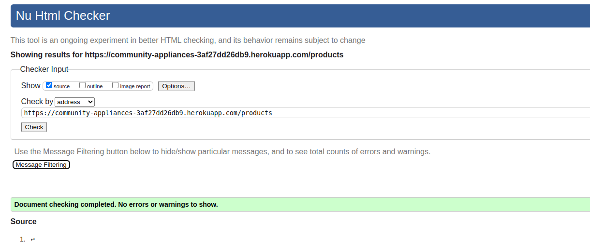
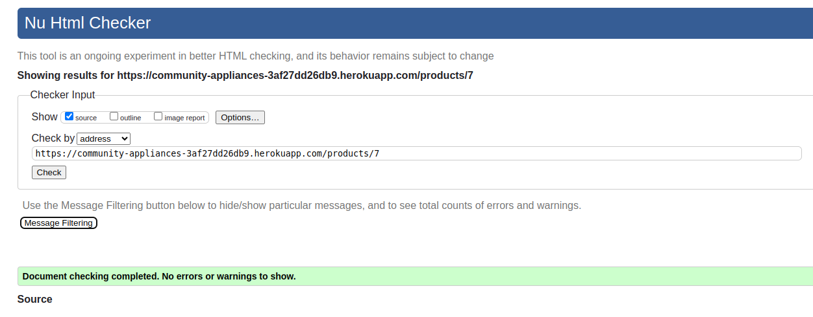

# Testing

Return back to the [README.md](README.md) file.

### HTML

I have used the recommended [HTML W3C Validator](https://validator.w3.org) to validate all of my HTML files. All pages were validated on the live website. Were possible pages were validated by address. For pages only available to logged in users the html source code was copied from the browser and validated with the text input option.

| Page | W3C URL | Screenshot |Notes |
| --- | --- | --- | --- |
| Home | [W3C](https://validator.w3.org/nu/?showsource=yes&doc=https%3A%2F%2Fcommunity-appliances-3af27dd26db9.herokuapp.com%2F) |  |no errors or warnings |
| Products | [W3C](https://validator.w3.org/nu/?showsource=yes&doc=https%3A%2F%2Fcommunity-appliances-3af27dd26db9.herokuapp.com%2Fproducts%2F) |  | no errors or warnings|
| Product Detail | [W3C](https://validator.w3.org/nu/?showsource=yes&doc=https%3A%2F%2Fcommunity-appliances-3af27dd26db9.herokuapp.com%2Fproducts%2F6) |  | no errors or warnings|
| Products | [W3C]() |  | no errors or warnings|
| Products | [W3C]() |  | no errors or warnings|

