# Testing

Return back to the [README.md](README.md) file.

### HTML

I have used the recommended [HTML W3C Validator](https://validator.w3.org) to validate all of my HTML files. All pages were validated on the live website. Were possible pages were validated by address. For pages only available to logged in users the html source code was copied from the browser and validated with the text input option in the validator. The same procedure was used  pages such as "cart" and "checkout" which could only be meaningfully validated were there is some user interaction with the page.

| Page | W3C URL | Screenshot/Validation Method |Notes |
| --- | --- | --- | --- |
| Home | [W3C](https://validator.w3.org/nu/?showsource=yes&doc=https%3A%2F%2Fcommunity-appliances-3af27dd26db9.herokuapp.com%2F) |  |no errors or warnings |
| Products | [W3C](https://validator.w3.org/nu/?showsource=yes&doc=https%3A%2F%2Fcommunity-appliances-3af27dd26db9.herokuapp.com%2Fproducts%2F) |  | no errors or warnings|
| Product Detail | [W3C](https://validator.w3.org/nu/?showsource=yes&doc=https%3A%2F%2Fcommunity-appliances-3af27dd26db9.herokuapp.com%2Fproducts%2F6) |  | no errors or warnings|
| Checkout | n/a | text input | no errors or warnings|
| Cart | n/a | text input | no errors or warnings|
| Checkout Success | n/a | text input | no errors or warnings|
| Profile | n/a | text input | no errors or warnings|
| Order History | n/a | text input | no errors or warnings|
| Volunteers | n/a | text input | no errors or warnings|

### CSS

I have used the recommended [CSS Jigsaw Validator](https://jigsaw.w3.org/css-validator) to validate all of my CSS files.

| File | Jigsaw URL | Screenshot/Validation method | Notes|
| --- | --- | --- | --- |
| base.css | [Jigsaw](https://jigsaw.w3.org/css-validator/validator?uri=https%3A%2F%2Fcommunity-appliances-3af27dd26db9.herokuapp.com%2F&profile=css3svg&usermedium=all&warning=1&vextwarning=&lang=en) || no errors|
| product.css | n/a |text input| no errors|
| checkout.css | n/a |text input| minor warning about vendor extension|

### Python PEP8 Compatibility

I have used the [CI Python Linter](https://pep8ci.herokuapp.com/)  to check Python code for compatibility with the [PEP8 standard](https://peps.python.org/pep-0008/).

| Python File | Screenshot | Notes |
| --- | --- | --- |
| cart apps.py |  | No errors |
| cart contexts.py |  | No errors |
| cart urls.py |  | No errors |
| cart views.py |  | No errors |
| cart views.py |  | No errors |
| checkout urls.py |  | No errors |
| checkout apps.py |  | No errors |
| checkout forms.py |  | No errors |
| checkout models.py |  | No errors |
| checkout signals.py |  | No errors |
| checkout admin.py |  | No errors |
| checkout views.py |  | No errors |
| home views.py |  | No errors |
| home urls.py |  | No errors |
| products admin.py |  | No errors |
| products models.py |  | No errors |
| products urls.py | 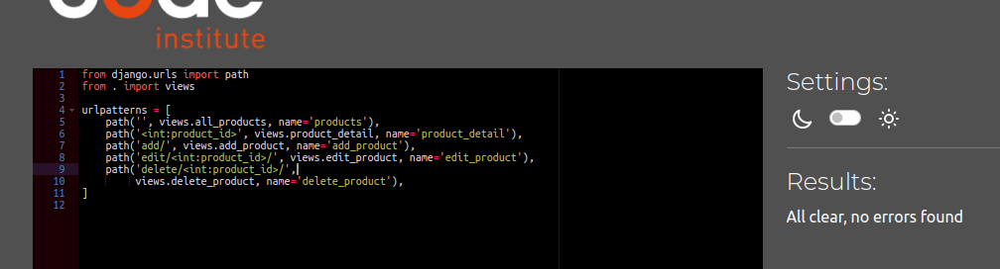 | No errors |
| products views.py |  | No errors |
| profiles admin.py |  | No errors |
| profiles forms.py |  | No errors |
| profiles models.py |  | No errors |
| profiles views.py |  | No errors |
| profiles urls.py |  | No errors |
| volunteers admin.py |  | No errors |
| volunteers forms.py |  | No errors |
| volunteers models.py |  | No errors |
| volunteers urls.py |  | No errors |
| volunteers views.py |  | No errors |
| community-appliances custom_storages.py |  | No errors |
| community-appliances settings.py |  | No errors |
| community-appliances urls.py |  | No errors |

### JavaScript

I have used the recommended [JShint Validator](https://jshint.com) to validate all of my JS files.

| File | Screenshot | Notes |
| --- | --- | --- |
| stripe_elements.js |  | Undefined Stripe variable from external library |

### Browser Compatibility

I have tested my deployed project on multiple browsers to check for compatibility issues.

| Browser | Home | Products | Product Detail | Cart | Checkout | Checkout Success | Profile | Volunteers | Order History | Notes |
| --- | --- | --- | --- | --- | --- | --- | --- | --- | --- | --- |
| Chrome |  |  | |||||| | Works as expected 
| Opera |  | 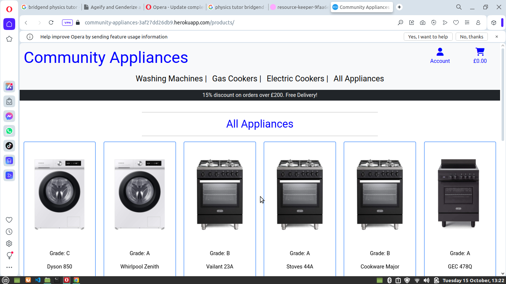 | |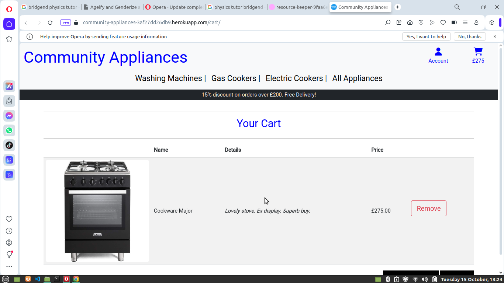||||| | Works as expected 
| Firefox |  |  | |||||| 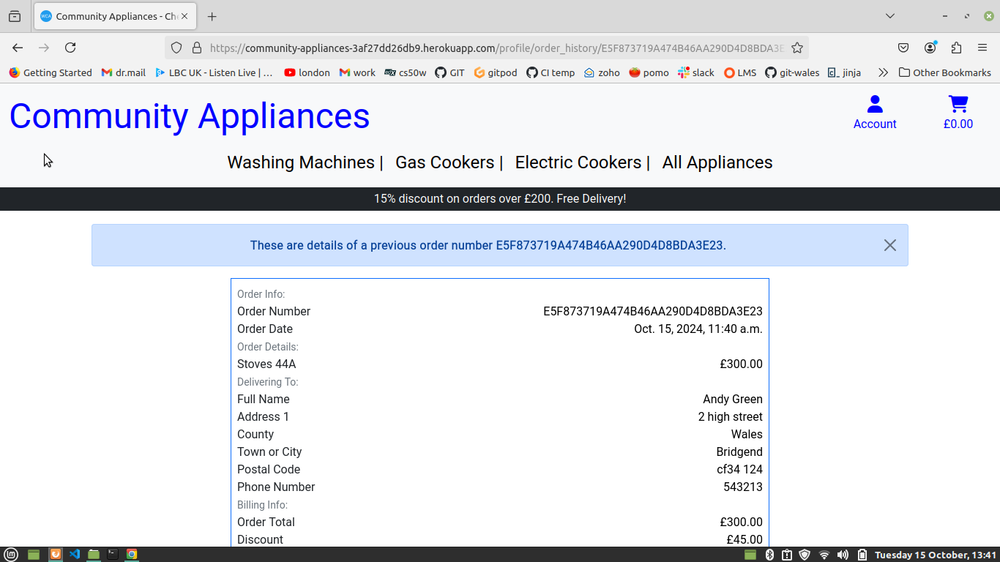| Works as expected 

### Responsiveness

I have tested my deployed project on multiple devices to check for responsiveness issues.

| Device | Home | Products | Product Detail | Cart | Checkout | Checkout Success | Profile | Volunteers | Order History | Notes |
| --- | --- | --- | --- | --- | --- | --- | --- | --- | --- | --- |
| mobile |  |  | |||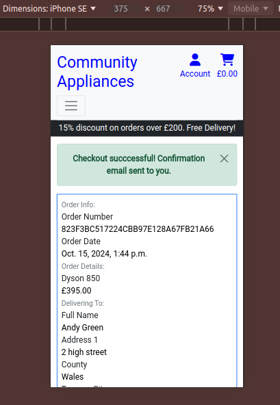||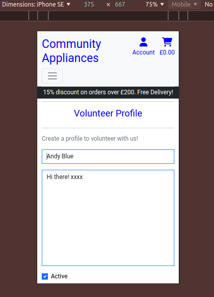| | Works as expected 
| tablet | 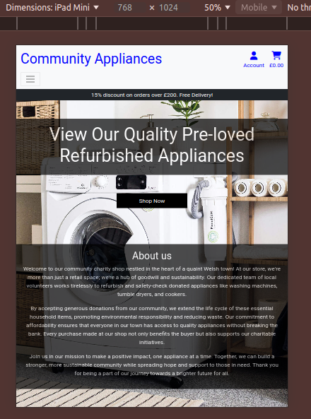 | 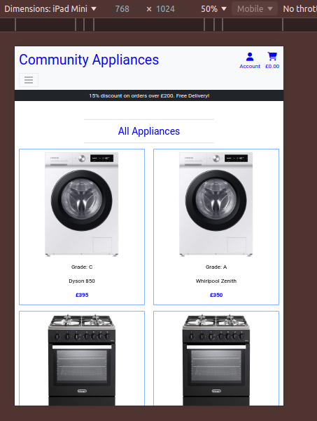 | 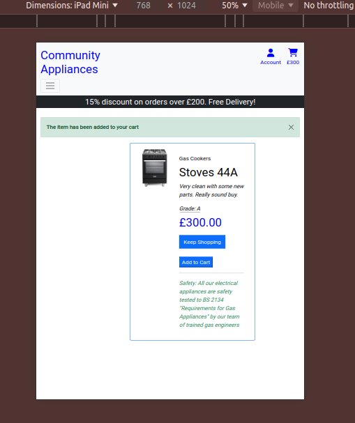|||||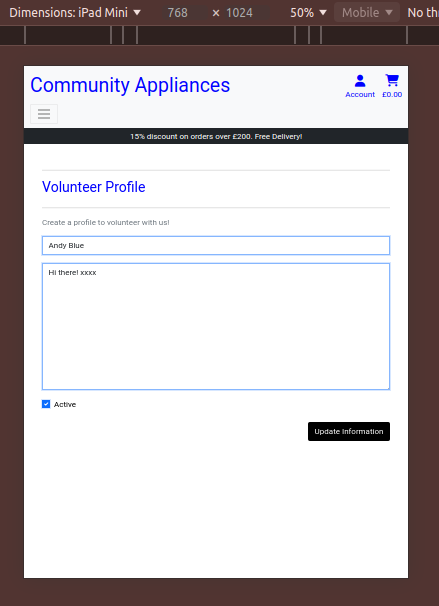| 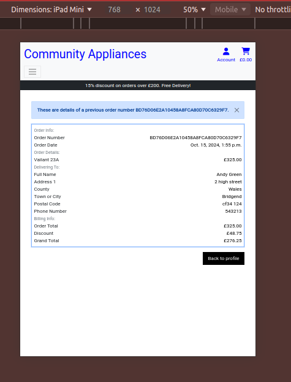| Works as expected 

